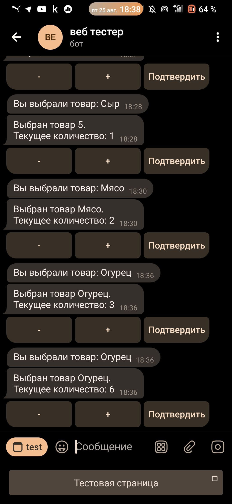

# Проект телеграм-бота по продаже через TelegramWebApps



Данный проект представляет собой телеграм-бота, разработанного на языке Python, который предназначен для продажи продуктов. Он состоит из двух частей: веб-сайта и самого бота.

## Функциональность

- Пользователи могут просматривать список доступных продуктов.
- Пользователи могут добавлять выбранные продукты в корзину.
- Пользователи могут оформить заказ и указать необходимые данные для доставки.
- Можно управлять списком продуктов через веб-интерфейс.

## Установка и запуск

1. Клонируйте репозиторий на локальную машину:

   ````
   git clone https://github.com/munnificent/bot.github.io/tree/main
   ````

2. Перейдите в каталог проекта:

   ```
   cd bot.github.io
   ```

3. Установите зависимости, используя pip:

   ````
   pip install -r requirements.txt
   ````

4. Настройте необходимые переменные окружения, такие как токен ботах.

5. Запустите веб-сервер и телеграм-бота:

   ````
   python bot.py
   ````

## Вклад в проект

Если вы хотите внести свой вклад в проект, вы можете сделать следующее:

- Открыть новый Issue с предложениями или обнаруженными ошибками.
- Предложить свои исправления или новый функционал путем создания Pull Request.

## Лицензия

Проект лицензирован под [Че хочу то и делаю](LICENSE).
